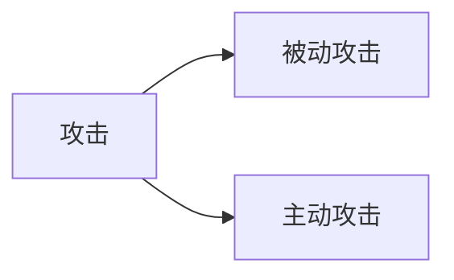
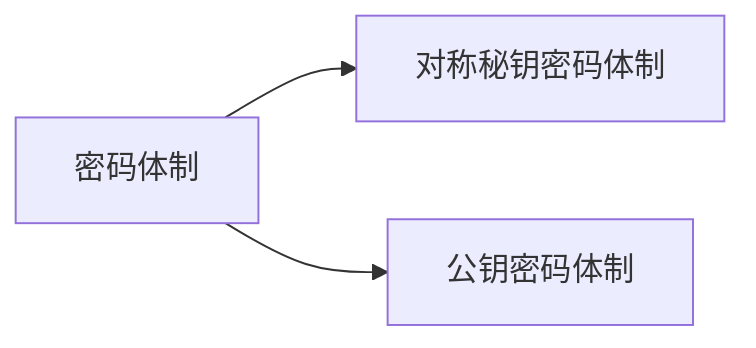
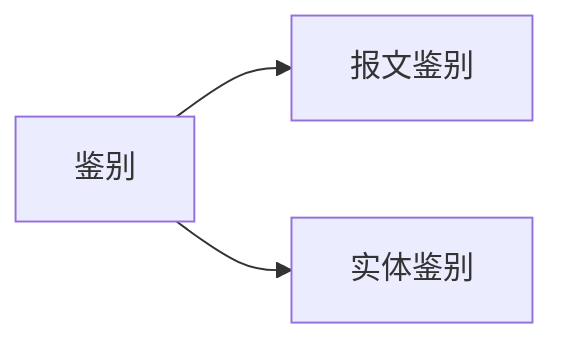

***关键词*** : 攻击与安全

__概述__ :
1. 计算机网络面临的安全性威胁和计算机网络安全的主要问题
2. 对称秘钥密码体制和公钥密码体制的特点
3. 数字签名与鉴别的概念
4. 网络层安全协议 IPsec 协议族和运输层安全协议 SSL/TLS 的要点
5. 应用层电子邮件的安全措施
6. 系统安全: 防火墙与入侵检测

### 网络安全问题

**被动攻击** : 被动攻击是指攻击者从网络上窃听他人的通信内容。通常称为 ***截获***
截获并分析 ***协议数据单元 PDU*** 的信息(控制信息、地址、身份)进行 ***流量分析 traffic analysis***
**主动攻击** :
a. 篡改: 包括 篡改报文、中断报文、伪造报文
b. 恶意程序: 病毒 virus、蠕虫 worm、特洛伊木马 Trojan horse、逻辑炸弹 logic bomb、后门入侵 backdoor knocking、流氓软件
c. 拒绝服务: Denial of Service DoS, 大量请求导致源服务器拒绝提供服务不再工作, 网络带宽攻击、交换机中毒

### 两类密码体制

__对称秘钥密码体制__ 加密秘钥与解密秘钥使用相同的密码体制
***数据加密标准 DES***: 秘钥占有 64 位(秘钥长 56 位，外加 8 位用于奇偶校验)
***高级加密标准 AES***

__公钥密码体制__ 使用不同的加密秘钥和解密秘钥
产生原因: 
a. 一是由于对称秘钥密码体制的 ***秘钥分配*** 问题
b. 二是由于对数字签名的需求

***RSA 体制***: 三位美国科学家 -- Rivest, Shamir, Adleman
多对一的单向保密通信
公钥: public key
私钥: secret key

### 数字签名
发送者用私钥对报文摘要进行 D 运算
功能:
1. 报文鉴别: 接受者能够确认是谁发送的报文
2. 报文的完整性: 接受者能够确认报文是否被篡改过
3. 不可否认: 发送者不能否认对报文的签名

### 鉴别 authentication
鉴别与授权(authorization)是不同的概念

__报文鉴别__
报文鉴别码 MAC: Message Authentication Code，将报文摘要加密之后附到报文的尾部
***密码散列函数***: 一种单向函数
MD5: Message Digest v5
SHA: 安全散列算法 Secure Hash Algorithm

__实体鉴别__
重放攻击: replay attach，使用 不重数(nonce 不重复使用的大随机数)

### 秘钥分配
秘钥管理: 秘钥的产生、分配、注入、验证和使用
1. 对称秘钥分配
  ***KDC***: 秘钥分配中心 Key Distribution Center
2. 公钥分配
  将公钥与对应实体绑定，证书具有统一的格式
  ***CA***: 认证中心 Certification Authority

### 互联网使用的安全协议
目前在网络层、运输层和应用层都有相应的网络安全协议
__网络层 安全协议__
1. IPsec 协议族
2. 安全关联 SA Security Association
3. IP 安全数据报的格式
4. IPsec 的其他构件
  安全关联数据库 SAD、安全策略数据库 SPD
__运输层 安全协议__ SSL/TLS
安全套接字层 SSL: Secure Socket Layer
运输层安全 TLS: Transport Layer Security

SSL 提供的服务:
a. SSL 服务器鉴别
b. SSL 客户鉴别
c. 加密的 SSL 会话

__应用层 安全协议__
有关电子邮件的安全协议
***PGP Pretty Good Privacy***: 是一个完整的电子邮件安全软件包，包括加密、鉴别、电子签名和压缩等技术

### 系统安全: 防火墙与入侵检测
__防火墙__: firewall，一种访问控制技术，严格控制进出网络边界的分组
防火墙是一种特殊编程的路由器，安装在一个网点和网络的其余部分之间，目的是实施访问控制策略
__入侵检测系统 IDS__: Intrusion Detection System
IDS 可以检测到多种网络攻击，包括网络映射、端口扫描、DoS攻击、蠕虫、病毒、系统漏洞攻击等

### 一些深入的方向
1. 椭圆曲线密码 ECC 与 AES  广泛用于电子护照中
2. 移动安全(Mobile Security)
3. 量子密码(Quantum Cryptography)