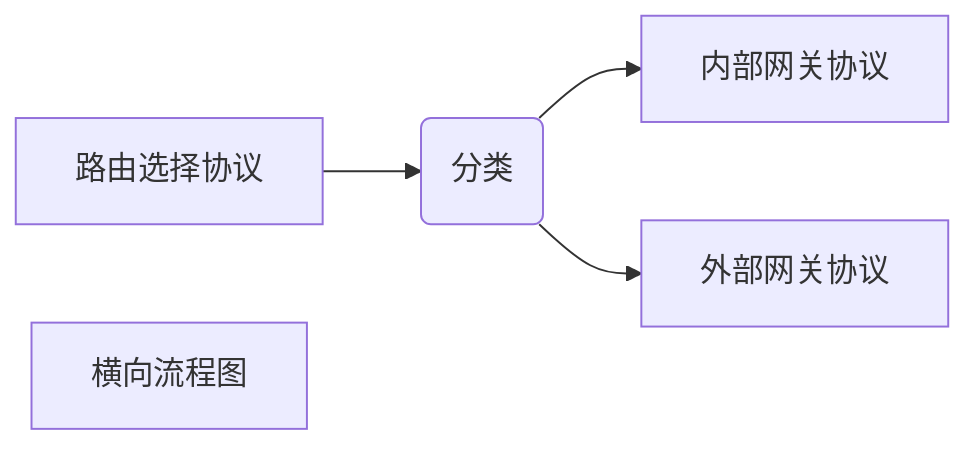
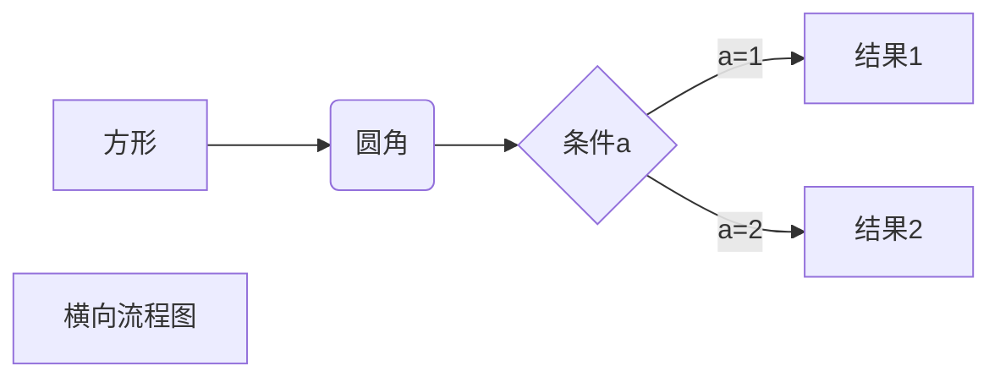

***关键词*** : 唯一前缀   Trie树   PING

根据路由选择协议构造和更新路由表

##### ICMP 的应用举例
***PING*** : 分组网间探测(Packet InterNet Groper) 是 ICMP 的一个重要应用，用来测试两台主机之间的连通性。PING 使用了 ICMP 回送请求与回送回答报文。PING 是应用层直接使用网络层 ICMP 的一个栗子🌰，它没有通过传输层的 TCP 或 UDP。(ping www.xx.com)

***traceroute(UNIX)/tracert(Win)*** : 用于跟踪一个分组从源点到终点的路径。

### 路由器
***分组丢失*** : 路由器中的输入输出队列产生溢出，或者设备、线路出故障

##### 路由选择协议
自治系统内部和自治系统之间

<!--more-->

### 虚拟专用网 VPN 和网络地址转换 NAT
##### 虚拟专用网 VPN :
    利用公用的互联网作为本机构各专用网之间的通信载体，这样的专用网称为 VPN (Virtual Private Network)
***内联网 VPN*** :
***外联网 VPN*** :
***远程接入 VPN*** : 个人电脑中的 VPN 软件和公司主机之间建立 VPN 隧道，进行加密通信

##### 网络地址转换 NAT : Network Address Translation
专用网内部主机(本地 IP 地址)和互联网主机通信
***NAT 路由器*** : 装有 NAT 软件的路由器，至少有一个有效的全球 IP 地址
***NAT 转换表*** :
通过使用运输层的端口号，可以更加有效的利用(复用)路由器的全球 IP 地址
***NAPT*** : Network Address and Port Translation 网络地址与端口号转换
统称 NAT
普通的路由器工作在网络层，而 NAT 路由器要查看和转换运输层的端口号

##### 多协议标记交换 MPLS
***概念*** : MPLS 利用 ***面向连接*** 技术，使每个分组携带一个叫做 ***标记(label)*** 的小整数(打上标记)。当分组到达交换机(即标记交换路由器)时，交换机读取分组的标记，并用标记值来检索分组转发表。这样比查找路由表来转发分组要快很多。
***标记交换*** : 对打上标记的 IP 数据报用硬件转发。即在转发时不再上升到第三层查找转发表，而是根据标记在第二层(数据链路层)用硬件转发。
***MPLS 域*** : MPLS domain 是指该域中有许多彼此相邻的 支持 MPLS 技术的 ***标记交换路由器 LSR(Label Switching Router)***(同时支持标记交换和路由选择功能)。
MPLS 首部 :

MPLS 作为一种 IP 增强技术，广泛地应用在互联网中
***过载*** : 缓存溢出，导致分组丢失、传输时延增大
***负载均衡*** :
1. 传统路由器只会选择最短路径，导致大量数据在同一条路径上传输

