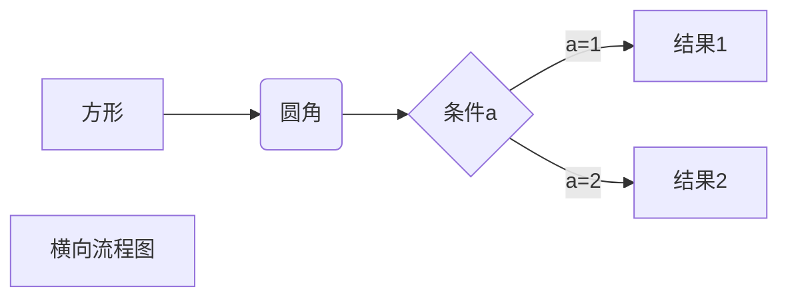

***关键词*** : 唯一前缀   Trie树   PING

##### ICMP 的应用举例
***PING*** : 分组网间探测(Packet InterNet Groper) 是 ICMP 的一个重要应用，用来测试两台主机之间的连通性。PING 使用了 ICMP 回送请求与回送回答报文。PING 是应用层直接使用网络层 ICMP 的一个栗子🌰，它没有通过传输层的 TCP 或 UDP。(ping www.xx.com)

